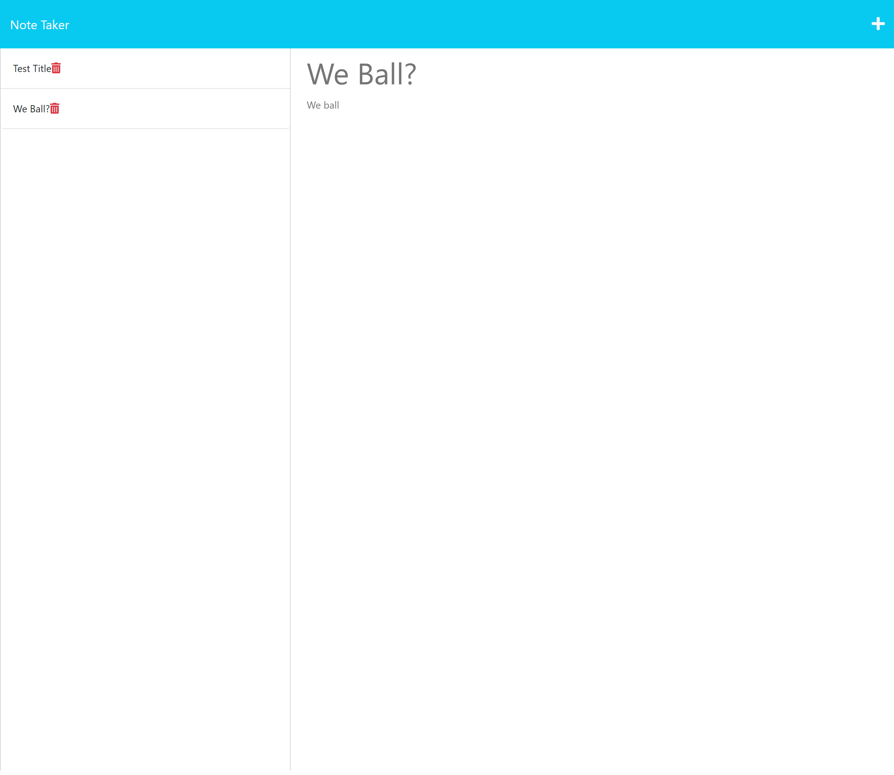

# Note Taker 

## Description

I refactored an application that functions as a note taker.

## Installation

N/A

## Usage 

This tool was created to practice the following skills:
- Using Markdown to write a README
- express
- Node.js
- deploying on Heroku

#### The work done can be found on the GitHub repository [zahirovic/Note-Taker](https://github.com/zahirovic/Note-Taker).

The live site can be found [here](https://note-taker-mz.herokuapp.com/) and should look along the lines of this:

## Credits
- [npm docs on creating a Package.JSON file](https://docs.npmjs.com/creating-a-package-json-file)
- [jquery for the cdn](https://jquery.com/download/)
- [Bootstrap](https://getbootstrap.com/)
- [Heroku on deploying with Git](https://devcenter.heroku.com/articles/git)
- [Heroku op deploying with GitHub](https://devcenter.heroku.com/articles/github-integration)

## Features
- Javascript
- Bootstrap
- Node
- express
